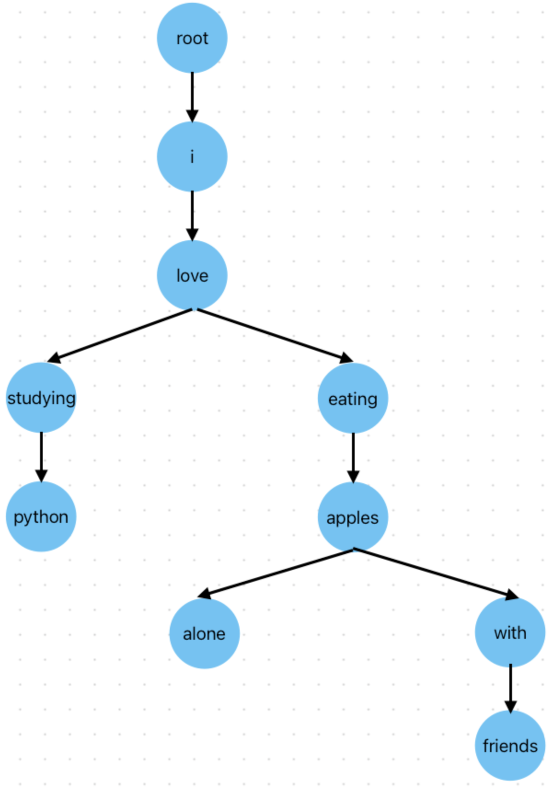
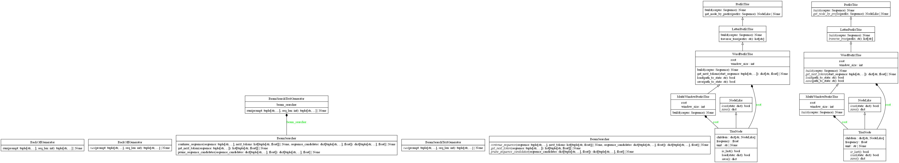
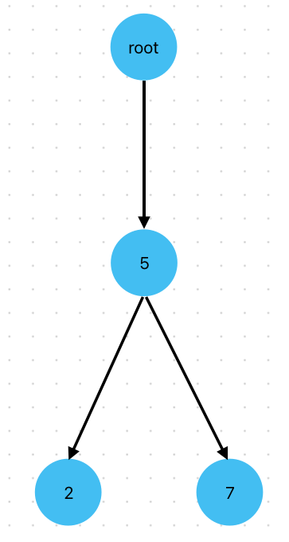
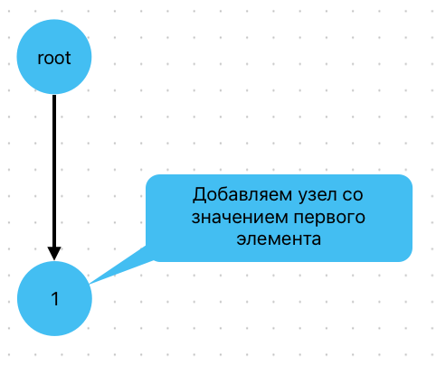
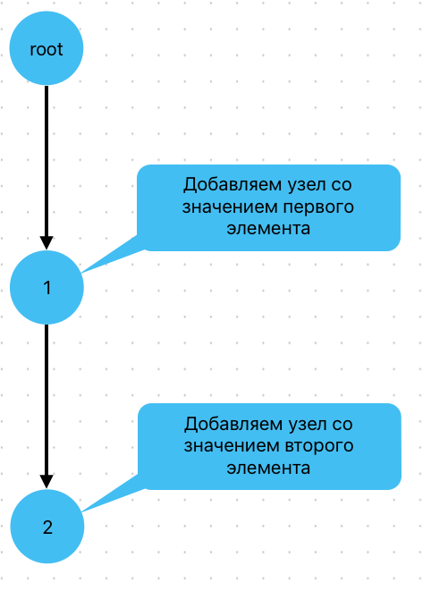

Лабораторная работа №4. Система генерации текста на основе префиксного дерева
========================================================================================

.. toctree::
    :maxdepth: 1
    :titlesonly:
    :caption: Full API

    lab_4_auto_completion.api.rst

.. important::

   Описание лабораторных работ и другие полезные материалы
   доступны на
   `сайте дисциплины <https://fipl-hse.github.io/docs/labs_2025/>`__

Дано
----

1. Текст на английском языке (``./assets/hp_letters.txt``),
   который загружен и сохранен в переменную ``hp_letters`` в ``start.py``

1. Текст на английском языке (``./assets/ussr_letters.txt``),
   который загружен и сохранен в переменную ``ussr_letters`` в ``start.py``

В рамках предыдущей лабораторной работы вы выполнили задачу построения корпуса н-грамм и генерации
текста на основе их частотности. Напомним, что для хранения последовательностей слов вы использовали
словарь. Однако, на практике такой формат хранения может быть неэффективным. Например, как вы могли
заметить, многие н-граммы имеют общие начальные последовательности, которые в словаре хранятся избыточное
количество раз.

**Проиллюстрируем проблему**: представим, что в нашем корпусе есть 1000 н-грамм, которые начинаются
со слов "я люблю". Получается, что в итоговом словаре-хранилище будут 1000 раз записаны эти два
слова, что задействует избыточный объем памяти.

Префиксное дерево решает эту проблему. Его структура позволяет хранить общие префиксы н-грамм только
один раз, что значительно экономит память. В заключительной, четвертой лабораторной работе вам
предстоит реализовать эту структуру данных и адаптировать под нее алгоритм генерации текста. Второе
важное отличие от предыдущей работы заключается в том, что теперь вам предстоит обрабатывать текст
на уровне слов, а не отдельных букв.

Структура префиксного дерева
-----------------------------

В базовой реализации префиксное дерево состоит из набора связанных узлов, каждый из которых
соответствует определенному символу:

   Структура префиксного дерева для данных последовательностей слов.

Как видно из картинки, все 4 н-граммы имеют минимальную общую начальную последовательность
**i love**, и в случае, если бы мы использовали для их хранения словарь, этот "префикс"
хранился бы 4 раза. В дереве же он сохраняется лишь единожды, что существенно снижает нагрузку
на память при большом объеме данных. Подробнее про префиксные деревья вы можете прочитать
`здесь <https://ru.wikipedia.org/wiki/Префиксное_дерево>`_.

Каждый узел хранит в себе:

* Соответствующий **символ**

* Ссылки на **дочерние узлы**

Предположим, что у нас есть корпус закодированных слов
`1, 2, 3, 4, 1, 2, 5, 6, 7, 1, 2, 3, 8, 9, 1, 2, 5, 10, 11, 1, 2, 3, 4, 12` и длина н-грамм - 3, тогда у нас
будет следующий набор н-грамм:

1. (1,2,3) - 3 раза
2. (1,2,5) - 2 раза
3. (2,3,4) - 2 раза
4. (2,3,8) - 1 раз
5. (2,5,6) - 1 раз
6. (2,5,10) - 1 раз
7. (3,4,1) - 1 раз
8. (3,4,12) - 1 раз
9. (3,8,9) - 1 раз
10. (4,1,2) - 1 раз
11. (5,6,7) - 1 раз
12. (5,10,11) - 1 раз
13. (6,7,1) - 1 раз
14. (7,1,2) - 1 раз
15. (8,9,1) - 1 раз
16. (9,1,2) - 1 раз
17. (10,11,1) - 1 раз
18. (11,1,2) - 1 раз

Дерево этих н-грамм будет выглядеть так (корневой узел должен хранить в себе
значение `None`):

::

    root: [None | 0.0]
        │
        ├── [1 | 0.0] → Начало триграмм (1,2,3), (1,2,5)
        │   │
        │   └── [2 | 0.0]
        │       │
        │       ├── [3 | 0.14]  → (1,2,3)
        │       │
        │       └── [5 | 0.09]  → (1,2,5)
        │
        │
        ├── [2 | 0.0] → Начало триграмм (2,3,4), (2,3,8), (2,5,6), (2,5,10)
        │   │
        │   ├── [3 | 0.0]
        │   │   │
        │   │   ├── [4 | 0.09]  → (2,3,4)
        │   │   │
        │   │   └── [8 | 0.05]  → (2,3,8)
        │   │
        │   └── [5 | 0.0]
        │       │
        │       ├── [6 | 0.05]  → (2,5,6)
        │       │
        │       └── [10 | 0.05] → (2,5,10)
        │
        │
        ├── [3 | 0.0] → Начало триграмм (3,4,1), (3,4,12), (3,8,9)
        │   │
        │   ├── [4 | 0.0]
        │   │   │
        │   │   └── [1 | 0.05]  → (3,4,1)
        │   │   │
        │   │   └── [12 | 0.05]  → (3,4,12)
        │   │
        │   └── [8 | 0.0]
        │       │
        │       └── [9 | 0.05]  → (3,8,9)
        │
        │
        ├── [4 | 0.0] → Начало триграммы (4,1,2)
        │   │
        │   └── [1 | 0.0]
        │       │
        │       └── [2 | 0.05]  → (4,1,2)
        │
        │
        ├── [5 | 0.0] → Начало триграммы (5,6,7), (5,10,11)
        │   │
        │   ├── [6 | 0.0]
        │   │   │
        │   │   └── [7 | 0.05]  → (5,6,7)
        │   │
        │   └── [10 | 0.0]
        │       │
        │       └── [11 | 0.05] → (5,10,11)
        │
        │
        ├── [6 | 0.0] → Начало триграммы (6,7,1)
        │    │
        │    └── [7 | 0.0]
        │        │
        │        └── [1 | 0.05]  → (6,7,1)
        │
        │
        ├── [7 | 0.0] → Начало триграммы (7,1,2)
        │    │
        │    └── [1 | 0.0]
        │        │
        │        └── [2 | 0.05]  → (7,1,2)
        │
        │
        ├── [8 | 0.0] → Начало триграммы (8,9,1)
        │    │
        │    └── [9 | 0.0]
        │         │
        │         └── [1 | 0.05]  → (8,9,1)
        │
        │
        ├── [9 | 0.0] → Начало триграммы (9,1,2)
        │    │
        │    └── [1 | 0.0]
        │         │
        │         └── [2 | 0.05]  → (9,1,2)
        │
        │
        └── [10 | 0.0] → Начало триграммы (10,11,1)
        │    │
        │    └── [11 | 0.0]
        │         │
        │         └── [1 | 0.05]  → (10,11,1)
        │
        │
        └── [11 | 0.0] → Начало триграммы (11,1,2)
        │    │
        │    └── [1 | 0.0]
        │         │
        │         └── [2 | 0.05]  → (11,1,2)

Как видно, каждый узел, являющийся концом н-граммы, хранит в себе относительную частоту
данной н-граммы по отношению ко всему корпусу н-грамм.
В конечном итоге программа должна автоматически дополнять изначальный промпт
(начальную последовательность символов) до текста заданной длины посредством
использования префиксного дерева.

В данной лабораторной работе генерация текста будет происходить следующим образом:

1. Алгоритм начинается с заданного промпта (начальной последовательности символов)
2. Из промпта берется контекст - последние (N-1) символов, где N - размер n-граммы
3. В префиксном дереве находится узел, соответствующий этому контексту
4. Среди всех дочерних узлов текущего контекста выбирается узел с наибольшей вероятностью
5. Символ, соответствующий выбранному узлу, добавляется к сгенерированной последовательности
6. Контекст обновляется: удаляется символ слева, добавляется новый в правую часть
7. Шаги 3-6 повторяются до достижения нужной длины текста

Для примера посмотрим на дерево выше и представим, что у нас есть закодированный промпт `[1, 2]`,
и мы хотим сгенерировать текст длиной 3 символа. Возьмем в качестве параметра размер н-грамм,
равный двум. Таким образом, контекст будет содержать последние :math:`2 - 1` слов из начальной
последовательности, а именно `[2]`. После этого среди всех дочерних узлов текущего контекста
выбирается наиболее вероятный. В нашем случае это узел со значением `3`. Значение этого узла
добавляется в конец последовательности, после чего контекст обновляется с `[2]` до `[3]`.
Мы достигли заданной длины текста, работа алгоритма завершается.
Мы получили закодированный текст `[1, 2, 3]`.

Визуально процесс выше можно представить так:

::

    Промпт:    [1, 2]
    Генерация первого символа:    [2] → 3 (самый вероятный символ)
    Итог:    [1, 2, 3]

Это краткий обзор того, что вам предстоит сделать в рамках текущей работы, ознакомьтесь с ним и
следуйте инструкциям ниже, чтобы реализовать полный алгоритм построения префиксного дерева и
генерации текста посредством его использования.

UML-диаграмма классов
---------------------

Что надо сделать
-----------------

Шаг 0. Начать работу над лабораторной (вместе с преподавателем на практике)
~~~~~~~~~~~~~~~~~~~~~~~~~~~~~~~~~~~~~~~~~~~~~~~~~~~~~~~~~~~~~~~~~~~~~~~~~~~

1. Создайте форк репозитория.
2. Установите необходимые инструменты для работы.
3. Измените файлы ``main.py`` и ``start.py``.
4. Закоммитьте изменения и создайте Pull request.

.. important:: В файле ``start.py`` вы должны написать код
               для построения и использования префиксного дерева.

Для этого реализуйте функции в модуле ``main.py`` и импортируйте их в
``start.py``. Весь код, выполняющий операции с деревом, должен быть
выполнен в функции ``main`` в файле ``start.py``:

.. code:: py

   def main() -> None:
       pass

Вызов функции в файле ``start.py``:

.. code:: py

   if __name__ == '__main__':
       main()

В рамках данной лабораторной работы **нельзя использовать модули
collections, itertools, а также сторонние модули.**

Шаг 1. Творческое задание (будет анонсировано преподавателем на лекции)
~~~~~~~~~~~~~~~~~~~~~~~~~~~~~~~~~~~~~~~~~~~~~~~~~~~~~~~~~~~~~~~~~~~~~~~~~~~

.. important:: Выполнение Шага 1 соответствует 4 баллам.

Шаг 2. Создать пользовательские исключения
~~~~~~~~~~~~~~~~~~~~~~~~~~~~~~~~~~~~~~~~~~~~~~~~~~~~~~~~~~~~~~~~~~~~~~~~~~~

Перед началом работы со структурой префиксного дерева и его составляющими вам
необходимо реализовать несколько пользовательских исключений. Создание пользовательских
исключений направлено на то, чтобы сделать код более читаемым и ясным. Например,
вместо возврата `None` при ошибках в функциях можно создать для каждого типа ошибки
собственное исключение, которое сразу укажет на место и тип ошибки, что существенно
упрощает работу по отладке кода.

Для создания пользовательского исключения вам нужно создать новый класс, который
наследуется от базового класса `Exception`. Внутри данного класса может находиться
дополнительная логика обработки исключения или просто докстринг.
В нашем случае второго варианта достаточно. Пример класса пользовательского исключения
может выглядеть так:

.. code-block:: python
    :linenos:

    class CustomException(Exception):
        """
        Exception raised when something fails due to something
        """

В данной лабораторной работе вам необходимо создать 5 исключений:

1. **TriePrefixNotFoundError** - появляется, когда требуемый для перехода префикс отсутствует
   в дереве.

2. **EncodingError** - появляется при сбое кодирования текста из-за неправильного ввода или
   ошибки обработки

3. **DecodingError** - появляется при сбое декодирования текста из-за неправильного ввода или
   ошибки обработки

4. **IncorrectNgramError** - появляется при попытке использовать неподходящий размер н-грамм

5. **IncorrectCorpusError** - появляется в случае, если используется неправильный корпус

Шаг 3. Определить класс для обработки слов
~~~~~~~~~~~~~~~~~~~~~~~~~~~~~~~~~~~~~~~~~~~~~~~~~~~~~~~~~~~~~~~~~~~~~~~~~~~

В прошлой лабораторной работе вы уже реализовывали класс для обработки текста, теперь
вам необходимо создать на его основе новый класс для работы со словами, а не с отдельными
буквами.

В итоге у вас должен получиться класс :py:class:`lab_4_auto_completion.main.WordProcessor`,
являющийся наследником класса :py:class:`lab_3_generate_by_ngrams.main.TextProcessor`,
который выполняет полный цикл обработки текста на уровне слов с сохранением структуры предложений.

Обратите внимание: вам **не нужно** реализовывать инициализацию данного класса, так как он не
имеет своих уникальных атрибутов по отношению к родительскому классу.

Шаг 3.1. Реализовать метод для токенизации текста
~~~~~~~~~~~~~~~~~~~~~~~~~~~~~~~~~~~~~~~~~~~~~~~~~~~~~~~~~~~~~~~~~~~~~~~~~~~

Переопределите метод :py:meth:`lab_4_auto_completion.main.WordProcessor._tokenize`, который
в отличие от одноименного метода родительского класса разбивает текст на предложения, а не
отдельные слова.

Метод работает следующим образом:

1. Исходный текст разделяется на предложения
2. Каждое предложение обрабатывается следующим образом:

   1. Предложение приводится к нижнему регистру
   2. Предложение разбивается на слова по пробелам
   3. Каждое слово очищается от небуквенных символов
   4. Очищенное слово добавляется в результирующий массив
   5. После последнего слова предложения добавляется `end_of_word_token`

3. Шаг 2 происходит до того момента, пока не будут обработаны все предложения, переданные во
входной аргумент `text`.

Предположим, что на вход метода подано предложение `Hello World! How are you?`. На выходе у нас
должен получиться кортеж, содержащий все обработанные предложения, в нашем случае
`("hello", "world", "<EOW>", "how", "are", "you", "<EOW>")`.

Обратите внимание: для разделения предложений в данной работе используется именно
`end_of_word_token`, который в предыдущей лабораторной отвечал за разделение слов. Это сделано
для того, чтобы не создавать в дочернем классе дополнительный атрибут, цель использования
которого совпадает с целью атрибута родительского класса.

.. note:: В случае, если на вход метода подается неправильное значение или результирующий массив
          отсутствует, метод должен поднимать исключение `EncodingError`.

Шаг 3.2. Реализовать метод для вставки слов в хранилище
~~~~~~~~~~~~~~~~~~~~~~~~~~~~~~~~~~~~~~~~~~~~~~~~~~~~~~~~~~~~~~~~~~~~~~~~~~~

Переопределите метод :py:meth:`lab_4_auto_completion.main.WordProcessor._put`. Одноименный метод
родительского класса добавлял только буквы в хранилище. Теперь же этот метод должен добавлять
слова в хранилище `_storage`.

Предположим, что метод получает на вход последовательно символы `hello`, `world`, `hello`,
`beautiful`. Изначально хранилище содержит в себе только `end_of_word_token`. По мере
вставки слов хранилище будет изменяться следующим образом:

1. `_storage = {'<EOW>': 0, 'hello': 1}` после вставки первого слова
2. `_storage = {'<EOW>': 0, 'hello': 1, 'world': 2}` после вставки второго слова
3. `_storage = {'<EOW>': 0, 'hello': 1, 'world': 2}` - ничего не происходит, слово `hello` уже есть
4. `_storage = {'<EOW>': 0, 'hello': 1, 'world': 2, 'beautiful': 3}` - после вставки последнего
   слова

Шаг 3.3. Реализовать метод для кодирования предложений
~~~~~~~~~~~~~~~~~~~~~~~~~~~~~~~~~~~~~~~~~~~~~~~~~~~~~~~~~~~~~~~~~~~~~~~~~~~

Реализуйте метод :py:meth:`lab_4_auto_completion.main.WordProcessor.encode_sentences`, который
используется для кодирования текста на уровне предложений.

Метод работает следующим образом:

1. Входной текст разбивается на предложения, которые приводятся к нижнему регистру
2. Все непустые предложения кодируются унаследованным методом `encode()`.

Обратите внимание, что метод должен возвращать объект типа `tuple`.

Для примера возьмем текст, уже использованный ранее: `Hello World! How are you?`. Этот текст после
обработки виде будет выглядеть следующим образом: `["hello world", "how are you"]`. После полной
обработки методом `encode_sentences` результат будет выглядеть так: `((1, 2), (3, 4, 5))`.

Шаг 3.4. Реализовать метод для обработки декодированного текста
~~~~~~~~~~~~~~~~~~~~~~~~~~~~~~~~~~~~~~~~~~~~~~~~~~~~~~~~~~~~~~~~~~~~~~~~~~~

Переопределите метод :py:meth:`lab_4_auto_completion.main.WordProcessor._postprocess_decoded_text`,
который принимает на вход последовательность элементов, хранящуюся в кортеже `decoded_corpus`, и
возвращает строковое представление данной последовательности. Так, все входные
последовательности из кортежа объединяются в список строк, разделителем которых является
`end_of_word_token`. Соответственно, каждой строке соответствует одно предложение.
После этого все предложения должны объединиться через точку с пробелом, и первая буква каждого
предложения должна стать заглавной.

Например, метод получает на вход кортеж `("hello", "world", "<EOW>", "how", "are", "you")`.
Результирующий массив будет выглядеть так: `["hello world", "how are you"]`, а после
финального преобразования будет возвращено значение `"Hello world. How are you."`.

.. note:: В случае, если на вход метода подается неправильное значение или результирующий список
          строк отсутствует, метод должен поднимать исключение `DecodingError`.

После этого шага ваш класс для обработки текста готов. Теперь необходимо реализовать
структуру префиксного дерева - непосредственную основу для будущего хранилища н-грамм.

Шаг 4. Определить сущность узла префиксного дерева
~~~~~~~~~~~~~~~~~~~~~~~~~~~~~~~~~~~~~~~~~~~~~~~~~~~~~~~~~~~~~~~~~~~~~~~~~~~

Каждое префиксное дерево состоит из узлов, связанных друг с другом.
Узел представляет собой сущность, в которой хранится
следующая информация:

1. Непосредственно элемент, соответствующий данному узлу (в нашем случае
   закодированное слово)

2. Ссылки на все дочерние узлы

В узлах дерева может храниться и другая информация, необходимая для конкретной
задачи. Позже вы увидите, что в нашем случае является необходимым хранить частоту
каждого слова, в противном случае было бы невозможно выбрать наилучших кандидатов для
дополнения.

Шаг 4.1. Объявить сущность узла префиксного дерева
~~~~~~~~~~~~~~~~~~~~~~~~~~~~~~~~~~~~~~~~~~~~~~~~~~~~~~~~~~~~~~~~~~~~~~~~~~~

Реализуйте инициализатор класса :py:class:`lab_4_auto_completion.main.TrieNode`.
Класс имеет 2 атрибута: 1 приватный и 1 защищенный:

1. **__data** - элемент, соответствующий данному узлу (обратите внимание, что в нашем случае тип
   элемента - целое число, так как далее вам предстоит закодировать слова в виде строк в числа)

2. **_children** - список всех дочерних узлов

Оба этих атрибута должны быть объявлены при инициализации. На момент инициализации список
дочерних узлов должен быть пуст.

Шаг 4.2. Реализовать метод, возвращающий элемент, хранящийся в данном узле
~~~~~~~~~~~~~~~~~~~~~~~~~~~~~~~~~~~~~~~~~~~~~~~~~~~~~~~~~~~~~~~~~~~~~~~~~~~~~~~~~~~~~

Реализуйте метод :py:meth:`lab_4_auto_completion.main.TrieNode.get_data`, который
должен возвращать значение элемента, который хранится в узле. Такие методы называются
**геттерами**. Геттеры обеспечивают один из основных принципов ООП - инкапсуляцию,
позволяя внешнему коду получать информацию о конфигурации узла без прямого доступа к
внутренним атрибутам класса. Подробнее про **геттеры** и связанные с ними **сеттеры**
вы можете прочитать `в этом месте <https://pythonpip.ru/osnovy/gettery-settery-python>`_.

Шаг 4.3. Реализовать метод, возвращающий дочерние узлы
~~~~~~~~~~~~~~~~~~~~~~~~~~~~~~~~~~~~~~~~~~~~~~~~~~~~~~~~~~~~~~~~~~~~~~~~~~~~~~~~~~~~~

Реализуйте метод :py:meth:`lab_4_auto_completion.main.TrieNode.get_children`. На вход данного
метода может подаваться значение аргумента `item`, по умолчанию оно равняется `None`. В случае,
если значение аргумента не заполнено, метод должен вернуть кортеж **всех** дочерних узлов.
В случае, если значение аргумента `item` явно указано, должен возвращаться кортеж только из тех
дочерних узлов, значение которых равняется значению `item`.

.. important:: Данный метод должен использовать созданный вами на прошлом шаге метод
               :py:meth:`lab_4_auto_completion.main.TrieNode.get_data` для нахождения
               значения дочерних узлов

Шаг 4.4. Переопределить служебный метод для проверки наличия дочерних узлов
~~~~~~~~~~~~~~~~~~~~~~~~~~~~~~~~~~~~~~~~~~~~~~~~~~~~~~~~~~~~~~~~~~~~~~~~~~~~~~~~~~~~~

Переопределите магический метод :py:meth:`lab_4_auto_completion.main.TrieNode.__bool__`.
Метод должен вернуть `True` в случае, если узел имеет дочерние узлы.

По умолчанию Python считает объект `True`, если он не является:

1. `None`, `False`
2. числом `0` или `0.0`
3. пустой коллекцией (`[]`, `{}`, `()`, `""`, `set()`)

Класс `TrieNode` по умолчанию всегда возвращает `True`, поскольку не попадает под эти условия.
Однако в контексте префиксного дерева логичнее связывать булево значение с наличием у узла
дочерних узлов.

Предположим, у нас есть узел:

.. code-block:: python
    :linenos:

    without_children = TrieNode(__data=5, _children=[])
    with_children = TrieNode(__data=5, _children=[TrieNode(__data=7, _children=[])])

    def check(node: TrieNode):
        return bool(node) # Без переопределения метода всегда будет возвращать True

    # Без переопределенного метода __bool__
    check(without_children) # Вернет True
    check(with_children) # Тоже вернет True
    # С переопределенным методом
    check(without_children) # Вернет False, так как дочерних узлов нет
    check(with_children) # Вернет True, так как есть дочерние узлы

Шаг 4.5. Реализовать метод, возвращающий результат проверки на наличие дочерних узлов
~~~~~~~~~~~~~~~~~~~~~~~~~~~~~~~~~~~~~~~~~~~~~~~~~~~~~~~~~~~~~~~~~~~~~~~~~~~~~~~~~~~~~~~~~~~~~~

Реализуйте метод :py:meth:`lab_4_auto_completion.main.TrieNode.has_children`, который должен
возвращать результат работы переопределенного метода
:py:meth:`lab_4_auto_completion.main.TrieNode.__bool__`: возвращать `True`, если у узла есть
дочерние узлы, и `False` в обратном случае.

Шаг 4.6. Реализовать метод для добавления дочернего узла
~~~~~~~~~~~~~~~~~~~~~~~~~~~~~~~~~~~~~~~~~~~~~~~~~~~~~~~~~~~~~~~~~~~~~~~~~~~~~~~~~~~~~~~~~~~~~~

Реализуйте метод :py:meth:`lab_4_auto_completion.main.TrieNode.add_child`. Метод принимает
на вход значение `item`, после чего вставляет в массив дочерних узлов
объект класса `TrieNode` с этим значением, работа метода должна выглядеть так:

.. code-block:: python
    :linenos:

    node = TrieNode(__data=5, _children=[])

    node.add_child(2) # Внутри метода создается объект TrieNode со значением 2 и добавляется в список
                         # дочерних узлов
    node.add_child(7) # Внутри метода создается объект TrieNode со значением 7 и добавляется в список
                         # дочерних узлов

   В результате данной операции дерево будет иметь следующую структуру:

Шаг 4.7. Переопределить служебный метод, возвращающий значение узла
~~~~~~~~~~~~~~~~~~~~~~~~~~~~~~~~~~~~~~~~~~~~~~~~~~~~~~~~~~~~~~~~~~~~~~~~~~~~~~~~~~~~~~~~~~~~~~~~~~~~

Переопределите магический метод :py:meth:`lab_4_auto_completion.main.TrieNode.__str__`, который
должен возвращать строковое представление узла в формате
`"TrieNode(data = Значение узла в строковом представлении)"`.

.. note:: В случае, если значение узла отсутствует, этот узел является корнем, поэтому в значение
          корневого узла должна быть записана строка "root".

Работа метода может выглядеть так:

.. code-block:: python
    :linenos:

    node = TrieNode(__data=5, _children=[])
    root = TrieNode(__data=None, _children=[])

    repr(node) # Выведет "TrieNode(data=5)"
    repr(root) # Выведет "TrieNode(data="root")"

Шаг 5.1. Объявить сущность для построения базового префиксного дерева
~~~~~~~~~~~~~~~~~~~~~~~~~~~~~~~~~~~~~~~~~~~~~~~~~~~~~~~~~~~~~~~~~~~~~~~~~~~~~~~~~~~~~~~~~~~~~~~~~~~~

Теперь, после создания сущности узла дерева, перейдем к реализации абстракции самого префиксного
дерева. Создайте класс :py:class:`lab_4_auto_completion.main.PrefixTrie`.
Описание внутреннего атрибута: `self._root` - корневой узел, объект класса `TrieNode`.

Шаг 5.2. Переопределить служебный метод, возвращающий строковое представление префиксного дерева
~~~~~~~~~~~~~~~~~~~~~~~~~~~~~~~~~~~~~~~~~~~~~~~~~~~~~~~~~~~~~~~~~~~~~~~~~~~~~~~~~~~~~~~~~~~~~~~~~~~~

Переопределите магический метод :py:meth:`lab_4_auto_completion.main.PrefixTrie.__str__`, который
должен возвращать строковое представление объекта дерева в формате
`"PrefixTrie()"`.

Шаг 5.3. Реализовать алгоритм вставки последовательности в префиксное дерево
~~~~~~~~~~~~~~~~~~~~~~~~~~~~~~~~~~~~~~~~~~~~~~~~~~~~~~~~~~~~~~~~~~~~~~~~~~~~~~~~~~~~~~~~~~~~~~~~~~~~

На данном этапе вам необходимо реализовать метод
:py:meth:`lab_4_auto_completion.main.PrefixTrie._insert`, который выполняет операцию вставки
заданной последовательности `sequence` в дерево.

Работа метода выглядит следующим образом:

1. Задается переменная - текущий узел, для которого мы будем искать дочерние узлы. На начальном
   этапе текущим узлом является корневой узел

2. Если элемента заданной последовательности нет в списке дочерних узлов текущего узла, то надо
   создать его, а иначе - сделать его текущим и искать следующий элемент заданной последовательности
   для нового текущего узла

3. Алгоритм продолжается до тех пор, пока не будет произведен обход всей заданной последовательности

.. note:: Для поиска дочерних узлов и создания нужного дочернего узла метод должен использовать
          реализованные вами ранее методы :py:meth:`lab_4_auto_completion.main.TrieNode.get_children`
          и :py:meth:`lab_4_auto_completion.main.TrieNode.add_child`.

Предположим, у нас есть дерево, состоящее только из корневого узла, и нам надо добавить в него
последовательность `(1, 2)`.

Первый элемент последовательности - `1`, мы не нашли его в списке дочерних узлов корневого узла,
поэтому создаем для корневого узла новый дочерний узел, хранящий значение `1`, и переходим в
этот узел.

Следующее значение префикса - `2`, оно отсутствует среди дочерних узлов текущего узла (нашего
только что созданного узла со значением `1`), создаем для текущего узла новый дочерний узел со
значением `2`. В случае, если бы, например, в изначальном дереве помимо корневого узла
уже был бы его дочерний узел со значение `1`, то мы бы сразу перешли в него, и осталось бы
добавить только узел со значением `2`, являющийся дочерним для узла со значением `1`.

Визуализация данного алгоритма выглядит следующим образом:

На первом этапе мы создаем дочерний узел корневого узла со значением `1`:

Далее переходим в только что созданный узел. Поскольку наша входная последовательность `1, 2`
добавлена еще не полностью, создаем дочерний узел текущего узла:

Шаг 5.4. Реализовать операцию очистки всего префиксного дерева
~~~~~~~~~~~~~~~~~~~~~~~~~~~~~~~~~~~~~~~~~~~~~~~~~~~~~~~~~~~~~~~~~~~~~~~~~~~~~~~~~~~~~~~~~~~~~~~~~~~~

Реализуйте метод :py:meth:`lab_4_auto_completion.main.PrefixTrie.clean`, задача которого - очистить
все префиксное дерево, сделав его пустым. Метод выполняет данную задачу посредством того, что создает
новый корневой узел, в результате чего все предыдущие данные удаляются.

Шаг 5.5. Реализовать операцию поиска по префиксу
~~~~~~~~~~~~~~~~~~~~~~~~~~~~~~~~~~~~~~~~~~~~~~~~~~~~~~~~~~~~~~~~~~~~~~~~~~~~~~~~~~~~~~~~~~~~~~~~~~~~

Одна из базовых операций, связанных с префиксным деревом -
поиск по префиксу. Для выполнения этой операции реализуйте метод
:py:meth:`lab_4_auto_completion.main.PrefixTrie.get_prefix`.

Работа метода происходит следующим образом:

1. Задается переменная - текущий узел, для которого мы будем искать дочерние узлы. На начальном
   этапе текущим узлом является корневой узел

2. После этого для текущего узла находится дочерний узел, значение которого соответствует текущему
   элементу префикса, начиная с первого

3. Если такой узел не найден, должно быть поднято исключение `TriePrefixNotFoundError`, в обратном
   же случае найденный дочерний узел должен стать текущим

После обработки всех элементов префикса должен возвращаться конечный узел.

**Ключевой момент**: этот метод возвращает именно **узел**,
соответствующий концу префикса, что позволяет продолжить работу с поддеревом.

Возьмем для примера часть дерева, которое было полностью показано в начале документа:

::

    root: [None]
        │
        ├── [1] → Начало триграмм (1,2,3), (1,2,5)
        │   │
        │   └── [2]
        │       │
        │       ├── [3]  → (1,2,3)
        │       │
        │       └── [5]  → (1,2,5)
        │
        │
        ├── [2] → Начало триграмм (2,3,4), (2,3,8), (2,5,6), (2,5,10)
        │   │
        │   ├── [3]
        │   │   │
        │   │   ├── [4]  → (2,3,4)
        │   │   │
        │   │   └── [8]  → (2,3,8)
        │   │
        │   └── [5]
        │       │
        │       ├── [6]  → (2,5,6)
        │       │
        │       └── [10] → (2,5,10)

Вот как будет выглядеть результат работы данного метода для этого дерева:

.. code-block:: python
    :linenos:

    trie = PrefixTrie() # Предположим, что все нужные узлы уже были добавлены в дерево
    trie.get_prefix(2, 3, 8) # Вернет TrieNode(__data=8)
    trie.get_prefix(1, 2) # Вернет TrieNode(__data=2)

Шаг 5.6. Найти все возможные продолжения для заданного префикса
~~~~~~~~~~~~~~~~~~~~~~~~~~~~~~~~~~~~~~~~~~~~~~~~~~~~~~~~~~~~~~~~~~~~~~~~~~~~~~~~~~~~~~~~~~~~~~~~~~~~

Реализуйте метод :py:meth:`lab_4_auto_completion.main.PrefixTrie.suggest`, задача которого -
вернуть все возможные последовательности, которые начинаются с данного префикса.

Алгоритм работы данного метода следующий:

1. При помощи метода :py:meth:`lab_4_auto_completion.main.PrefixTrie.get_prefix` производится
   поиск узла, соответствующего данному префиксу, переданному в аргументе `prefix`

2. Если узел не найден, возвращается пустой массив

3. В остальных случаях происходит поиск всех возможных продолжений последовательности
   от найденного узла, в течение которого каждый следующий элемент добавляется к
   текущей последовательности до того момента, пока не будут достигнуты конечные узлы всех
   поддеревьев

Таким образом, метод находит все возможные продолжения заданного начала последовательности и
создает готовые последовательности с этими продолжениями.

Предположим, что у нас есть следующее дерево:

::

    root: [None]
        │
        ├── [1]
        │   │
        │   ├── [2]
        │   │   │
        │   │   ├── [3]  → (1,2,3)
        │   │   │
        │   │   └── [4]  → (1,2,4)
        │   │
        │   └── [5]
        │       │
        │       ├── [6]  → (1,5,6)
        │
        ├── [7]
        │   │
        │   ├── [8]  → (7, 8)

.. code-block:: python
    :linenos:

    PrefixTrie.suggest((1, 2)) # Вернет результат [(1, 2, 3), (1, 2, 4)]
    PrefixTrie.suggest((1)) # Вернет результат [(1, 2, 3), (1, 2, 4), (1, 5, 6)]
    PrefixTrie.suggest((7, 8)) # Вернет результат [(7, 8)]

Шаг 5.7. Реализовать алгоритм построения префиксного дерева
~~~~~~~~~~~~~~~~~~~~~~~~~~~~~~~~~~~~~~~~~~~~~~~~~~~~~~~~~~~~~~~~~~~~~~~~~~~~~~~~~~~~~~~~~~~~~~~~~~~~

Финальным шагом на оценку 6 является реализация алгоритма для построения префиксного дерева.
Реализуйте метод :py:meth:`lab_4_auto_completion.main.PrefixTrie.fill`, который
сначала производит операцию очистки дерева, а после для каждого элемента
в заданном корпусе выполняет операцию вставки этого элемента в дерево при помощи метода
:py:meth:`lab_4_auto_completion.main.PrefixTrie._insert`, реализованного вами в шаге 5.3. Таким образом
данный метод используется для построения полного дерева из входного набора символов. Так, если
в примере выше (в шаге 5.3) мы два раза вызывали метод
:py:meth:`lab_4_auto_completion.main.PrefixTrie._insert` для вставки каждого символа, один вызов метода
:py:meth:`lab_4_auto_completion.main.PrefixTrie.fill` приведет к созданию всего дерева.

Шаг 5.8. Продемонстрировать результаты в ``start.py``
~~~~~~~~~~~~~~~~~~~~~~~~~~~~~~~~~~~~~~~~~~~~~~~~~~~~~~~~~~~~~~~~~~~~~~~~~~~~~~~~~~~~~~~~~~~~~~~~~~~~

.. important:: Выполнение Шагов 2-5 соответствует 6 баллам.

Продемонстрируйте результат обновленной обработки текста и построения префиксного дерева
в функции ``main()`` модуля ``start.py``. Текст писем про Гарри Поттера должен быть
закодирован посредством метода :py:meth:`lab_4_auto_completion.main.WordProcessor.encode_sentences`,
после чего передан на вход метода :py:meth:`lab_4_auto_completion.main.PrefixTrie.fill` для
построения дерева. Далее при помощи метода :py:meth:`lab_4_auto_completion.main.PrefixTrie.suggest`
необходимо найти все продолжения для префикса со значением `2` и вывести на экран первую из
предложенных последовательностей в **декодированном** виде.

**Бонусное задание**

1. Выберите любой файл из папки ``assets/secrets``. В каждом таком
   файле содержится письмо студентов Хогвартса.
2. Выполните чтения файла и найдите место, которое было сожжено.
3. По указанному ниже размеру N-gram извлеките контекст для генерации сожженного текста.
4. Сгенерируйте текст с помощью алгоритма Beam
   Search :py:class:`lab_3_generate_by_ngrams.main.BeamSearcher`.
5. Вставьте сгенерированный текст на место пропуска в исходном письме.
6. Отправьте письмо своему ментору.

Используя следующую информацию для генерации:

* Секрет 1: `n_gram_size = 15`, `beam_width = 3`, `seq_len = 100`
* Секрет 2: `n_gram_size = 10`, `beam_width = 4`, `seq_len = 120`
* Секрет 3: `n_gram_size = 17`, `beam_width = 3`, `seq_len = 130`
* Секрет 4: `n_gram_size = 18`, `beam_width = 3`, `seq_len = 128`
* Секрет 5: `n_gram_size = 7`, `beam_width = 3`, `seq_len = 155`

.. important:: Количество бонусов ограничено.
               Один студент может отгадать не более одной загадки.
               Поэтому только первые 5 студентов, которые справятся с заданием,
               смогут получить бонус. Решение о применении бонуса принимается
               ментором и не подлежит оспариванию. Студент получит бонус, только
               если на момент выполнения задания в его форке опубликован
               актуальный код, который позволяет воспроизвести результат.

Шаг 6. Реализовать узел N-граммного дерева с поддержкой частоты
~~~~~~~~~~~~~~~~~~~~~~~~~~~~~~~~~~~~~~~~~~~~~~~~~~~~~~~~~~~~~~~~~~~~~~~~~~~

Для повышения качества генерации текста необходимо учитывать не только возможные
продолжения последовательностей, но и их частоту встречаемости в корпусе. Это требует
доработки структуры узла и алгоритмов построения дерева.

Шаг 6.1. Инициализировать класс NGramTrieNode
~~~~~~~~~~~~~~~~~~~~~~~~~~~~~~~~~~~~~~~~~~~~~~~~~~~~~~~~~~~~~~~~~~~~~~~~~~~

Инициализируйте класс :py:class:`lab_4_auto_completion.main.NGramTrieNode`, наследующийся от
:py:class:`lab_4_auto_completion.main.TrieNode`. Узел должен дополнительно хранить параметр
``_frequency`` — относительную частоту соответствующего n-грамма в корпусе. По умолчанию частота
равна ``0.0``. Значение может быть обновлено позже методом
:py:meth:`lab_4_auto_completion.main.NGramTrieNode.set_frequency`.

Шаг 6.2. Установление и получение частоты соответствующего n-грамма в корпусе
~~~~~~~~~~~~~~~~~~~~~~~~~~~~~~~~~~~~~~~~~~~~~~~~~~~~~~~~~~~~~~~~~~~~~~~~~~~~~

Реализуйте методы :py:meth:`lab_4_auto_completion.main.NGramTrieNode.get_frequency`
и :py:meth:`lab_4_auto_completion.main.NGramTrieNode.set_frequency`. Первый из них
должен возвращать относительную частоту соответствующего n-грамма в корпусе.
Второй метод кладёт новозаданную частоту в атрибут ``self._frequency``.

Шаг 6.3. Переопределить метод добавления дочернего узла
~~~~~~~~~~~~~~~~~~~~~~~~~~~~~~~~~~~~~~~~~~~~~~~~~~~~~~~~~~~~~~~~~~~~~~~~~~~

Переопределите метод :py:meth:`lab_4_auto_completion.main.NGramTrieNode.add_child`. Это
нужно, чтобы создавались экземпляры класса
:py:class:`lab_4_auto_completion.main.NGramTrieNode`,
а не :py:class:`lab_4_auto_completion.main.TrieNode`. Метод
:py:meth:`lab_4_auto_completion.main.NGramTrieNode.add_child` должен добавлять
экземпляры текущего класса в атрибут ``self._children``.

Шаг 6.4. Переопределить строковое представление узла
~~~~~~~~~~~~~~~~~~~~~~~~~~~~~~~~~~~~~~~~~~~~~~~~~~~~~~~~~~~~~~~~~~~~~~~~~~~

Переопределите метод :py:meth:`lab_4_auto_completion.main.NGramTrieNode.__str__`.
Строка должна возвращаться в формате ``NGramTrieNode(data, frequency)``.

.. note:: Если атрибут ``self.__data`` является None,
          то вместо корректного содержания выводится None.

Шаг 7. Реализовать языковую модель на основе N-граммного дерева с помощью NGramTrieLanguageModel
~~~~~~~~~~~~~~~~~~~~~~~~~~~~~~~~~~~~~~~~~~~~~~~~~~~~~~~~~~~~~~~~~~~~~~~~~~~~~~~~~~~~~~~~~~~~~~~~

Чтобы использовать N-граммное дерево для генерации текста, необходимо объединить
структуру данных с логикой обработки корпуса и предсказания следующих токенов.
Класс :py:class:`lab_4_auto_completion.main.NGramTrieLanguageModel`
инкапсулирует эту логику: он строит дерево из корпуса, вычисляет относительные частоты всех N-грамм
и предоставляет методы для получения вероятных продолжений заданного контекста.

Шаг 7.1. Инициализировать класс NGramTrieLanguageModel
~~~~~~~~~~~~~~~~~~~~~~~~~~~~~~~~~~~~~~~~~~~~~~~~~~~~~~~~~~~~~~~~~~~~~~~~~~~

Класс :py:class:`lab_4_auto_completion.main.NGramTrieLanguageModel` должен быть инициализирован
двумя параметрами (т.е. аргументами):

- ``encoded_corpus`` — кортеж закодированных предложений (или `None` при создании пустой модели),
- ``n_gram_size`` — целое положительное число, задающее размер окна для построения n-грамм.

Внутри инициализатора:

1. Вызывается ``NGramLanguageModel.__init__(self, encoded_corpus, n_gram_size)``,
   чтобы установить атрибуты ``_encoded_corpus`` и ``_n_gram_size``.
2. Корневой узел `_root` инициализируется как экземпляр
   :py:class:`lab_4_auto_completion.main.NGramTrieNode` (без аргументов,
   с частотой по умолчанию `0.0`).

Такая логика инициализации гарантирует, что все вставляемые в дерево узлы
будут поддерживать хранение частоты.

Шаг 7.2. Реализовать метод построения дерева
~~~~~~~~~~~~~~~~~~~~~~~~~~~~~~~~~~~~~~~~~~~~~~~~~~~~~~~~~~~~~~~~~~~~~~~~~~~

Реализуйте метод :py:meth:`lab_4_auto_completion.main.NGramTrieLanguageModel.build`. Он
строит модель префиксного дерева из корпуса. Дерево должно:

- Строиться на основе **скользящего окна** фиксированного размера ``n_gram_size``
- Хранить только **полные n-граммы** (длиной ровно ``n_gram_size``)
- После построения автоматически вычислять **относительные частоты** всех n-грамм
  и сохранять их в узлах, соответствующих последним токенам полных n-грамм
  (которые в данной реализации совпадают с листовыми узлами, так как дерево строится
  только из последовательностей длины ``n_gram_size``).

Если создание дерева прошло успешно, возвращается ``0``. В противном случае ``1``.

.. note:: В начале каждого вызова метода
          :py:meth:`lab_4_auto_completion.main.NGramTrieLanguageModel.build`
          необходимо обнулять дерево, то есть нужно повторно (как в методе
          :py:meth:`lab_4_auto_completion.main.NGramTrieLanguageModel.__init__`) инициализировать
          атрибут ``self._root``. Это требуется для того, чтобы метод работал именно
          с текущим корпусом.

.. note:: В рамках этого метода после формирования всех n-грамм
          с помощью скользящего окна и их вставки в дерево
          обязательно последовательно вызываются два метода:
          сначала :py:meth:`lab_4_auto_completion.main.NGramTrieLanguageModel._collect_all_ngrams`,
          чтобы получить полный список n-грамм, хранящихся в дереве, а затем
          :py:meth:`lab_4_auto_completion.main.NGramTrieLanguageModel._fill_frequencies`,
          которому передаётся этот список для вычисления и присвоения частот.

Шаг 7.3. Реализовать метод сбора n-грамм
~~~~~~~~~~~~~~~~~~~~~~~~~~~~~~~~~~~~~~~~~~~~~~~~~~~~~~~~~~~~~~~~~~~~~~~~~~~

Реализуйте метод :py:meth:`lab_4_auto_completion.main.NGramTrieLanguageModel._collect_all_ngrams`.
Он должен делать следующее:

1. Обход дерева, начиная с корня ``self._root``.
2. Сбор всех последовательностей токенов длиной ``n_gram_size``.
3. Возврат списка всех полных n-грамм, хранящихся в дереве.

Например, возвращаемое значение может выглядеть так:

.. code:: py

   [(10, 25, 33), (25, 33, 41), (33, 41, 5)]

Каждая n-грамма представлена как кортеж целых чисел, где числа — это ID токенов.

Шаг 7.4. Вычислить и присвоить относительные частоты n-граммам
~~~~~~~~~~~~~~~~~~~~~~~~~~~~~~~~~~~~~~~~~~~~~~~~~~~~~~~~~~~~~~~~~~~~~~~~~~~

Реализуйте метод :py:meth:`lab_4_auto_completion.main.NGramTrieLanguageModel._fill_frequencies`.
Он принимает на вход **кортеж полных n-грамм** (например, ``((1, 2, 3), (2, 3, 4), ...)``),
извлечённых из дерева методом
:py:meth:`lab_4_auto_completion.main.NGramTrieLanguageModel._collect_all_ngrams`.

Алгоритм работы:

1. Подсчитывается **абсолютная частота** каждой уникальной n-граммы в переданном списке.
2. Вычисляется **общее количество n-грамм** (длина входного кортежа).
3. Для каждой n-граммы вычисляется её **относительная частота** как:

.. math:: \text{частота} =
          \frac{\text{абсолютное количество вхождений n-граммы}}
          {\text{общее количество n-грамм}}

4. Эта частота присваивается **последнему узлу** соответствующей n-граммы в дереве
   через метод :py:meth:`lab_4_auto_completion.main.NGramTrieNode.set_frequency`.
   Узел находится вызовом ``self.get_prefix(ngram)``.

Таким образом, **в каждом листовом узле**, соответствующем завершению полной n-граммы,
хранится её **глобальная относительная частота** в корпусе.

Эти частоты используются методом
:py:meth:`lab_4_auto_completion.main.NGramTrieLanguageModel.generate_next_token`
для выбора наиболее вероятного продолжения:
среди дочерних узлов заданного контекста выбирается тот, у которого частота выше.

Шаг 7.5. Реализовать метод получения размера n-граммы
~~~~~~~~~~~~~~~~~~~~~~~~~~~~~~~~~~~~~~~~~~~~~~~~~~~~~~~~~~~~~~~~~~~~~~~~~~~

Реализуйте метод :py:meth:`lab_4_auto_completion.main.NGramTrieLanguageModel.get_n_gram_size`.
Он возвращает значение размера n-граммы, заданное при создании экземпляра.

Шаг 7.6. Реализовать метод расширения модели и обновления частот
~~~~~~~~~~~~~~~~~~~~~~~~~~~~~~~~~~~~~~~~~~~~~~~~~~~~~~~~~~~~~~~~~~~~~~~~~~~

Реализуйте метод :py:meth:`lab_4_auto_completion.main.NGramTrieLanguageModel.update`. Он
должен расширять существующую модель новыми n-граммами из дополнительного корпуса
и пересчитывать частоты на основе объединённого корпуса.

В рамках метода обязательно использовать атрибут ``self._encoded_corpus``. Он хранит
текущий закодированный корпус в виде кортежа
последовательностей токенов (предложений). При вызове метода
:py:meth:`lab_4_auto_completion.main.NGramTrieLanguageModel.update`:

- Если ``self._encoded_corpus`` равен ``None`` или пуст, он инициализируется как переданный
  новый корпус (``new_corpus``).
- Если ``self._encoded_corpus`` уже содержит данные, к нему добавляется новый корпус.

После обновления значения ``self._encoded_corpus`` необходимо вызвать
:py:meth:`lab_4_auto_completion.main.NGramTrieLanguageModel.build`,
чтобы полностью перестроить дерево и заново вычислить относительные частоты
на основе всего объединённого корпуса.

Шаг 7.7. Реализовать метод генерации возможных следующих токенов
~~~~~~~~~~~~~~~~~~~~~~~~~~~~~~~~~~~~~~~~~~~~~~~~~~~~~~~~~~~~~~~~~~~~~~~~~~~

Реализуйте метод :py:meth:`lab_4_auto_completion.main.NGramTrieLanguageModel.generate_next_token`.
Метод принимает на вход последовательность токенов и возвращает
**словарь возможных следующих токенов** и их **относительных частот**
(как они хранятся в узлах дерева).

Алгоритм работы:

1. Если входной аргумент не является непустым кортежем, метод возвращает ``None``.
2. Если длина входной последовательности **меньше ``n_gram_size - 1``**, метод возвращает ``None``
   (недостаточно контекста для предсказания).
3. Если всё в порядке, метод извлекает **последние ``n_gram_size - 1`` токенов** как **контекст**.
4. Далее метод вызывает
   :py:meth:`lab_4_auto_completion.main.NGramTrieLanguageModel.get_next_tokens`,
   передавая ему этот контекст (внутри
   :py:meth:`lab_4_auto_completion.main.NGramTrieLanguageModel.get_next_tokens`
   выполняется поиск узла, соответствующего контексту):

    - Если контекст **не найден в дереве**, выбрасывается исключение
      ``TriePrefixNotFoundError``, и метод возвращает **пустой словарь** ``{}``.
    - Если контекст найден,
      :py:meth:`lab_4_auto_completion.main.NGramTrieLanguageModel.get_next_tokens`
      собирает все дочерние узлы и возвращает
      словарь вида ``{токен: частота}``.

Шаг 7.8. Реализовать вспомогательные методы для генерации токенов
~~~~~~~~~~~~~~~~~~~~~~~~~~~~~~~~~~~~~~~~~~~~~~~~~~~~~~~~~~~~~~~~~~~~~~~~~~~

Реализуйте следующие вспомогательные методы, которые используются при генерации следующего токена:

- Метод **:py:meth:`lab_4_auto_completion.main.NGramTrieLanguageModel.get_node_by_prefix`**
  возвращает узел дерева, соответствующий заданному префиксу. Для этого
  вызывается унаследованный метод :py:meth:`lab_4_auto_completion.main.PrefixTrie.get_prefix`
  с передачей ему аргумента ``prefix``, по которому можно найти узел.

- Метод **:py:meth:`lab_4_auto_completion.main.NGramTrieLanguageModel.get_next_tokens`**
  принимает последовательность токенов ``start_sequence`` как контекст и возвращает
  словарь вида ``{токен: относительная частота}`` для всех возможных продолжений.

.. note:: Принцип работы метода
          :py:meth:`lab_4_auto_completion.main.NGramTrieLanguageModel.get_next_tokens`
          следующий:

          1. Находится узел, соответствующий контексту, с помощью
             :py:meth:`lab_4_auto_completion.main.PrefixTrie.get_prefix`,
          2. Если у узла нет дочерних узлов — возвращается пустой словарь ``{}``,
          3. Иначе вызывается
             :py:meth:`lab_4_auto_completion.main.NGramTrieLanguageModel._collect_frequencies`
             для сбора частот дочерних токенов.

- Метод **:py:meth:`lab_4_auto_completion.main.NGramTrieLanguageModel._collect_frequencies`**
  принимает узел и возвращает словарь ``{токен: частота}``, где:

    - **токен** — значение ``data`` дочернего узла,
    - **частота** — значение ``_frequency`` дочернего узла.

.. note:: Метод :py:meth:`lab_4_auto_completion.main.NGramTrieLanguageModel._collect_frequencies`
          обходит **только непосредственных потомков** переданного узла
          и игнорирует узлы с data = None.

Шаг 7.9. Переопределить строковое представление модели
~~~~~~~~~~~~~~~~~~~~~~~~~~~~~~~~~~~~~~~~~~~~~~~~~~~~~~~~~~~~~~~~~~~~~~~~~~~

Переопределите метод :py:meth:`lab_4_auto_completion.main.NGramTrieLanguageModel.__str__`.
Строка должна возвращаться в формате ``NGramTrieLanguageModel(X)``, где ``X`` — значение
атрибута ``self._n_gram_size``, заданное при инициализации модели. Например, если модель создана
при n_gram_size=3, то вызов ``str(model)`` должен вернуть строку
``NGramTrieLanguageModel(3)``.

Шаг 8. Продемонстрировать результаты в ``start.py``
~~~~~~~~~~~~~~~~~~~~~~~~~~~~~~~~~~~~~~~~~~~~~~~~~~~~~~~~~~~~~~~~~~~~~~~~~~~~~~~~~

.. important:: Выполнение Шагов 2-8 соответствует 8 баллам.

Продемонстрируйте результат в функции ``main()`` модуля ``start.py``.

1. **Постройте модель на основе корпуса ``assets/hp_letters.txt``**. Для этого:

    - Загрузите текст с помощью ``WordProcessor``,
    - Закодируйте его в последовательности токенов с помощью
      :py:meth:`lab_4_auto_completion.main.WordProcessor.encode_sentences`,
    - Создайте экземпляр :py:class:`lab_4_auto_completion.main.NGramTrieLanguageModel`
      с параметрами ``encoded_corpus`` и подходящим значением ``n_gram_size`` (например, 5),
    - Вызовите метод :py:meth:`lab_4_auto_completion.main.NGramTrieLanguageModel.build`.

2. **Добавьте второй корпус ``assets/ussr_letters.txt``** через метод
   :py:meth:`lab_4_auto_completion.main.NGramTrieLanguageModel.update`,
   чтобы расширить контекстную базу.

3. **Продемонстрируйте генерацию текста**. Для этого создайте экземпляры
   генераторов из лабораторной работы 3:

    - :py:class:`lab_3_generate_by_ngrams.main.GreedyTextGenerator` (жадный выбор),
    - :py:class:`lab_3_generate_by_ngrams.main.BeamSearchTextGenerator` (beam search).

.. note:: Оба генератора принимают в качестве аргументов
          вашу модель (``NGramTrieLanguageModel``) и ``WordProcessor``.

    Далее вызовите метод :py:meth:`lab_3_generate_by_ngrams.main.GreedyTextGenerator.run`
    и выведите результат для каждого генератора **до** и **после** вызова
    :py:meth:`lab_4_auto_completion.main.NGramTrieLanguageModel.update`.

4. **Сравните качество генерации**:

    - Проанализируйте, как изменяется сгенерированный текст **до и после объединения корпусов**.
    - Сравните результаты **жадного алгоритма** и **beam search**:
      какой из них даёт более связный, разнообразный или интересный текст?
